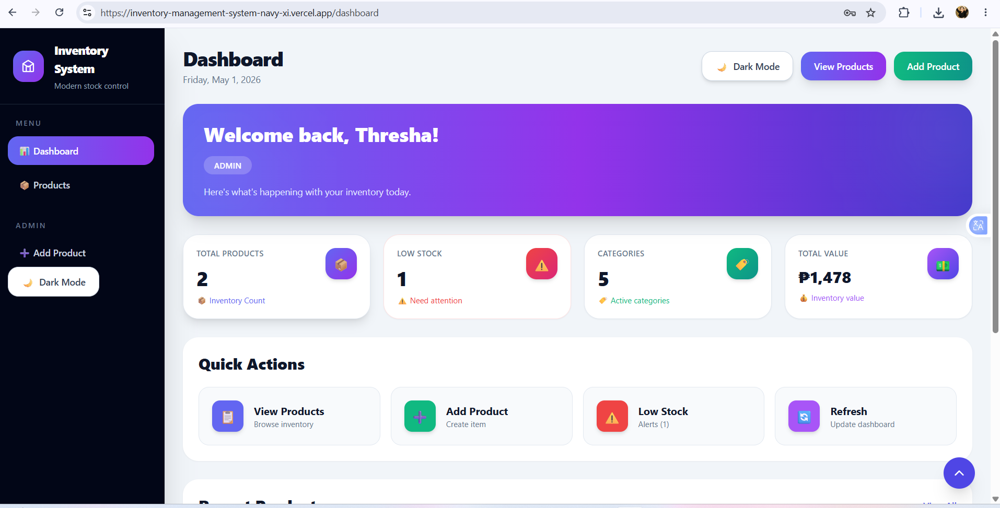
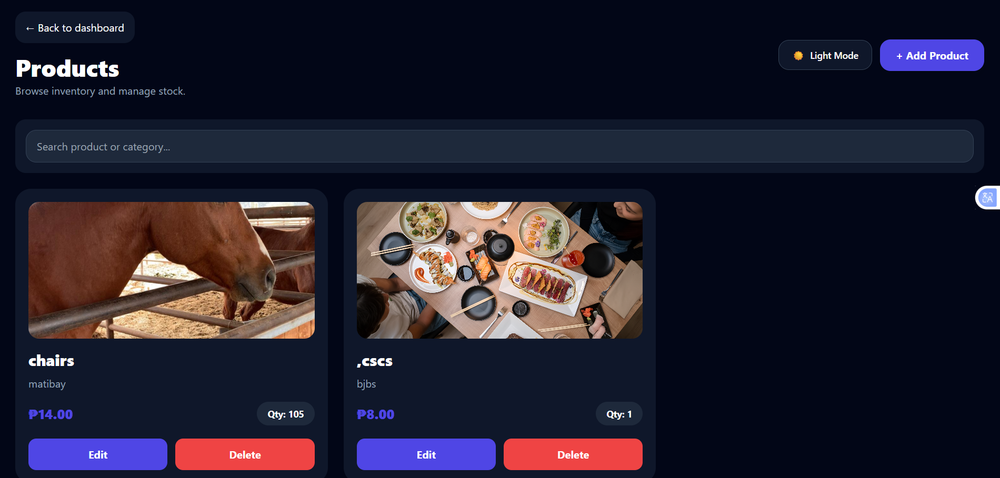
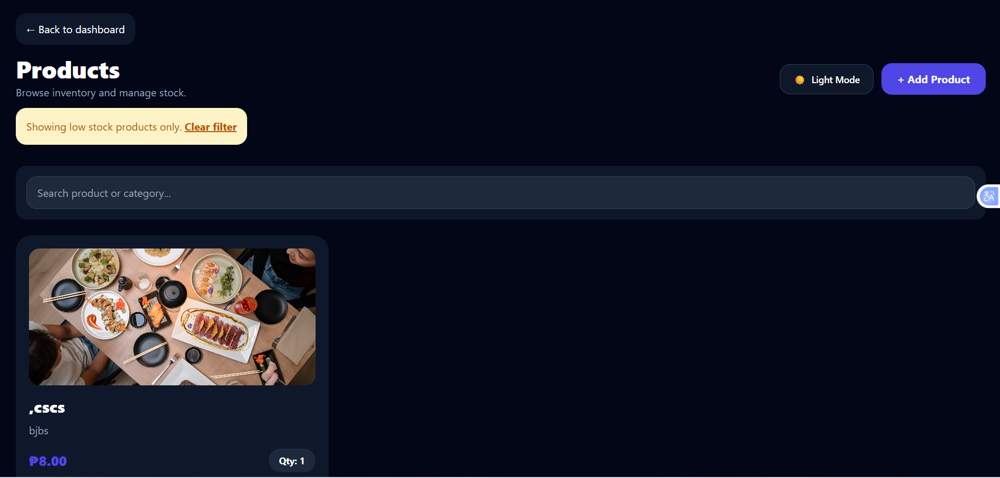
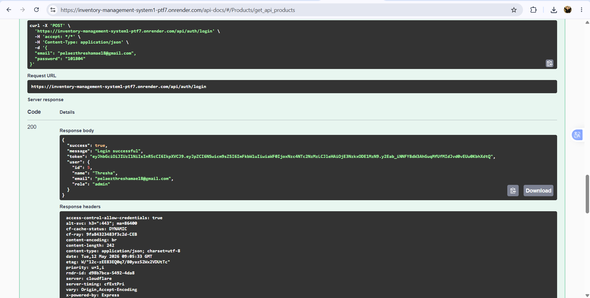
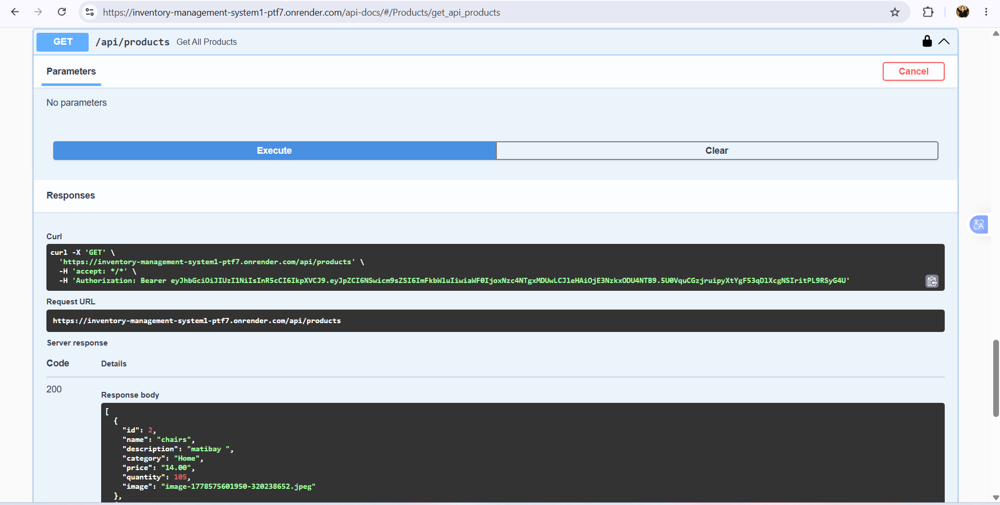
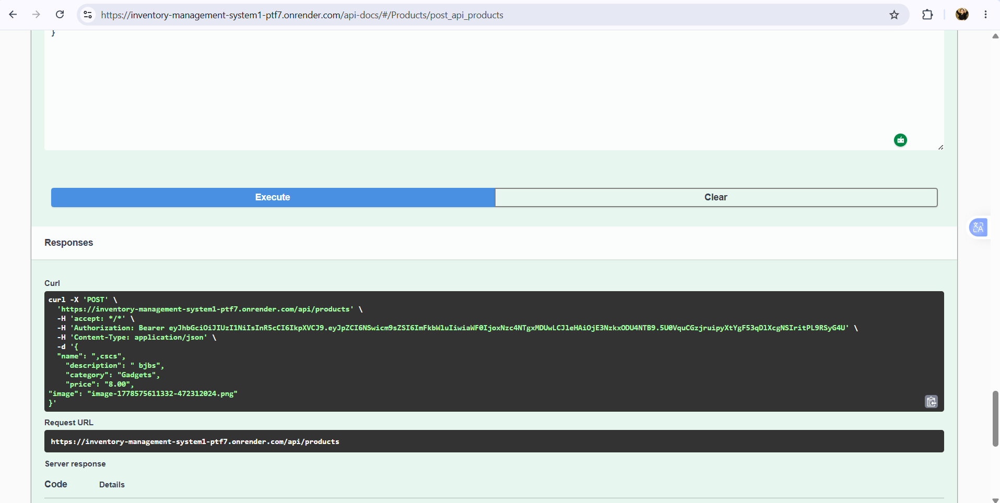

# 📸 Screenshots

## Authentication Pages

| Feature | Screenshot | Description |
|---|---|---|
| Login Page |  | User login page with secure JWT authentication, responsive layout, and protected access system. |
| Register Page |  | User registration form with validation, role selection, and account creation functionality. |

---

## Dashboard Pages

| Feature | Screenshot | Description |
|---|---|---|
| Admin Dashboard |  | Dashboard overview displaying total products, categories, low stock alerts, inventory value, and quick actions. |

---

## Product Management Pages

| Feature | Screenshot | Description |
|---|---|---|
| Admin View Products |  | Product management interface where administrators can monitor inventory and manage product records. |
| Low Stock Monitoring |  | Displays products with low inventory quantity for easier stock monitoring and management. |

---

## Swagger API Testing

| Endpoint | Screenshot | Description |
|---|---|---|
| POST `/api/auth/register` |  | Swagger API testing for user registration endpoint using request body validation. |
| POST `/api/auth/login` |  | Swagger API testing for user login and JWT token authentication. |
| GET `/api/products` |  | Protected API endpoint testing for retrieving all products using Bearer token authentication. |
| POST `/api/products` |  | Swagger API testing for creating new product entries with secured admin authorization. |

---