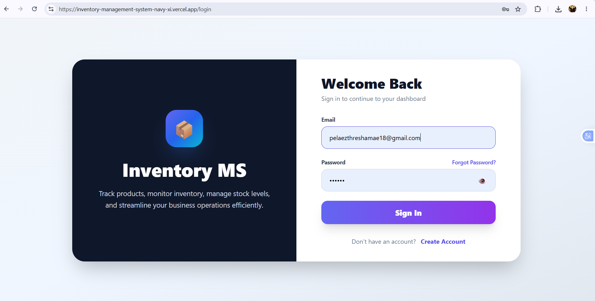
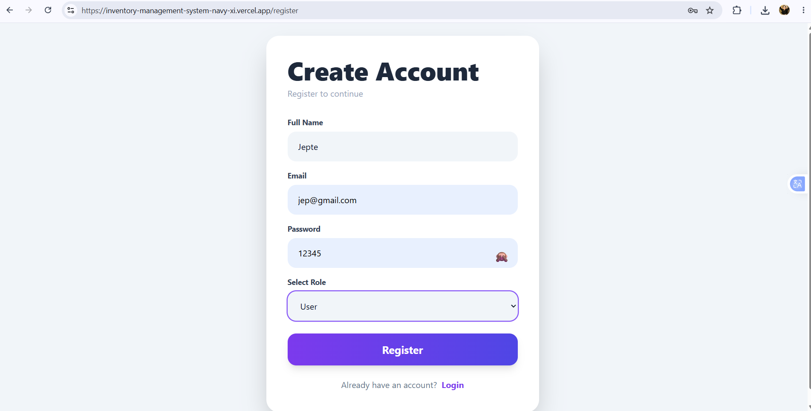
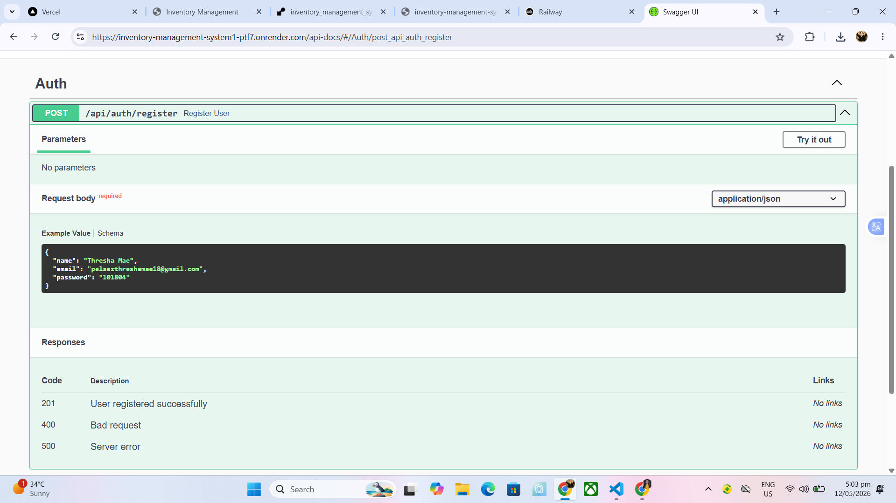

# Inventory Management System

## Project Overview

The Inventory Management System is a modern full-stack web application designed to help businesses manage products, inventory stock, categories, and users efficiently.

The system includes secure authentication, role-based access control, inventory monitoring, product management, and responsive dashboard analytics.

This project was built using Angular, Tailwind CSS, Node.js, Express.js, TypeScript, and MySQL.

---

# Live Links

## Frontend Deployment

🔗 https://inventory-management-system-hxx9xey8i.vercel.app

## Backend API

🔗 https://inventory-management-system1-ptf7.onrender.com

## Swagger API Documentation

🔗 https://inventory-management-system1-ptf7.onrender.com/api-docs

---

# Tech Stack

## Frontend

* Angular
* TypeScript
* Tailwind CSS
* RxJS

## Backend

* Node.js
* Express.js
* TypeScript
* JWT Authentication
* Multer

## Database

* MySQL
* Railway MySQL Hosting

## Deployment Platforms

* Vercel
* Render
* Railway

---

# Features Implemented

## Authentication Features

* User Registration
* User Login
* JWT Authentication
* Role-Based Access Control
* Protected Routes
* Forgot Password UI
* Show/Hide Password

## Dashboard Features

* Total Products Overview
* Low Stock Monitoring
* Category Counter
* Inventory Value Tracking
* Quick Action Cards
* Responsive Dashboard
* Dark Mode and Light Mode

## Product Management Features

### Admin Features

* Add Products
* Edit Products
* Delete Products
* Upload Product Images
* Search Products
* Low Stock Filtering

### User Features

* View Products
* Search Products
* Restricted CRUD Access

## Backend Features

* RESTful API
* MySQL Integration
* Multer File Upload
* Swagger API Documentation
* Error Handling Middleware
* Request Logging
* CORS Configuration

---

# Setup Instructions

## Clone Repository

```bash
git clone https://github.com/threshamaepelaez/inventory_management_system.git
```

---

# Frontend Setup

```bash
cd client
npm install
ng serve
```

Frontend runs at:

```bash
http://localhost:4200
```

---

# Backend Setup

```bash
cd server
npm install
npm run dev
```

Backend runs at:

```bash
http://localhost:5000
```

---

# Environment Variables

Create a `.env` file inside the server folder.

```env
PORT=5000
JWT_SECRET=your_secret_key
MYSQLHOST=your_mysql_host
MYSQLUSER=your_mysql_user
MYSQLPASSWORD=your_mysql_password
MYSQLDATABASE=your_database_name
MYSQLPORT=3306
```

---

# API Overview

| Method | Endpoint | Description |
|---|---|---|
| POST | `/api/auth/register` | Register new user |
| POST | `/api/auth/login` | User login |
| GET | `/api/products` | Get all products |
| POST | `/api/products` | Create new product |
| PUT | `/api/products/:id` | Update product |
| DELETE | `/api/products/:id` | Delete product |
| GET | `/api/dashboard/stats` | Dashboard statistics |

---

# Project Structure

```bash
inventory_management_system/
│
├── client/
│   ├── src/
│   ├── components/
│   ├── services/
│   ├── guards/
│   └── environments/
│
├── server/
│   ├── controllers/
│   ├── routes/
│   ├── middleware/
│   ├── config/
│   ├── uploads/
│   └── utils/
│
├── screenshots/
│
└── README.md
```

---

# Screenshots

## Authentication Pages

| Feature | Screenshot |
|---|---|
| Login Page |  |
| Register Page |  |

---

## Dashboard Pages

| Feature | Screenshot |
|---|---|
| Dashboard Light Mode |  |
| Dashboard Dark Mode |  |

---

## Products Pages

| Feature | Screenshot |
|---|---|
| Products Light Mode |  |
| Products Dark Mode |  |
| Low Stock Filter |  |

---

## API Testing

| Endpoint | Preview |
|---|---|
| POST `/api/auth/register` |  |

---

# Security Features

* JWT Authentication
* Role-Based Authorization
* Protected API Routes
* Admin Middleware
* Secure Password Handling
* CORS Protection

---

# Developers

* Thresha Mae Pelaez
* Leilanie Javellana
* Jepte Solinap

GitHub:
https://github.com/threshamaepelaez

---

# License

This project is for educational and portfolio purposes.